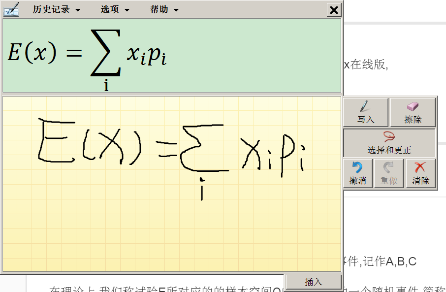
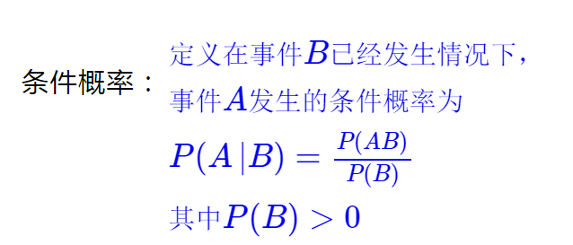
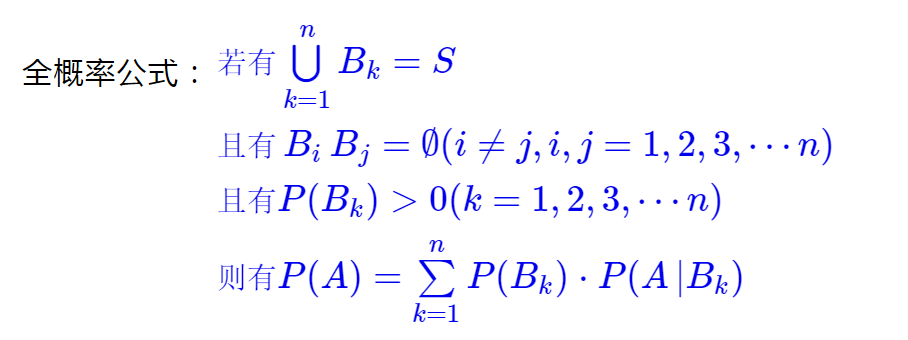
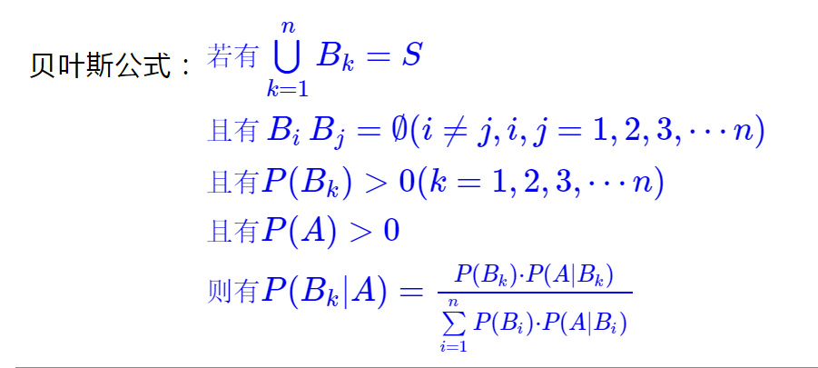
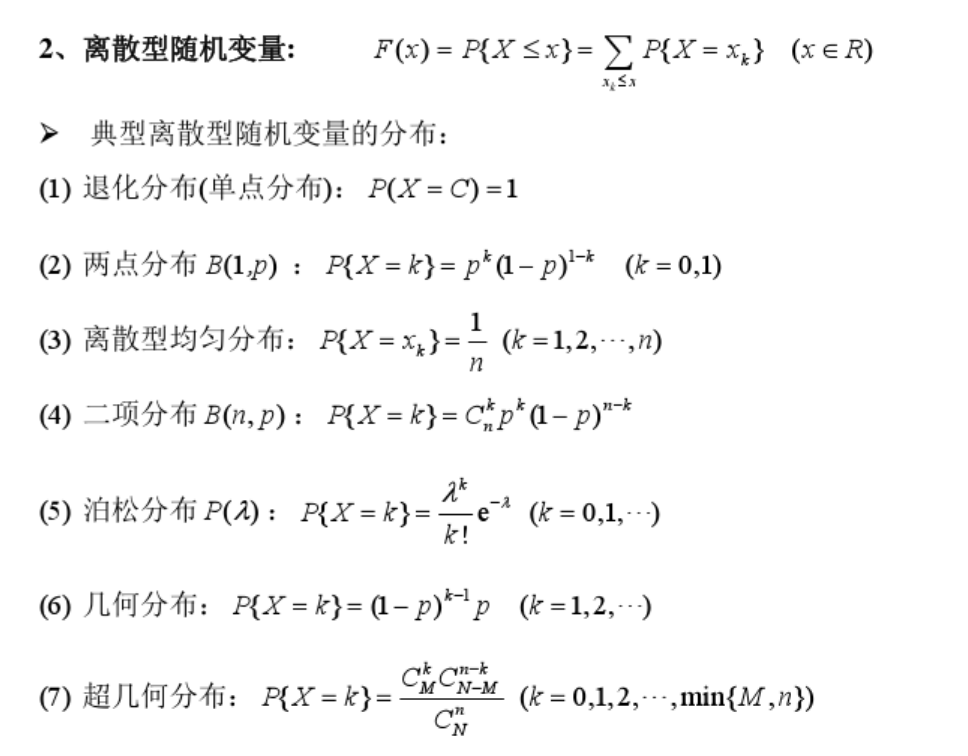
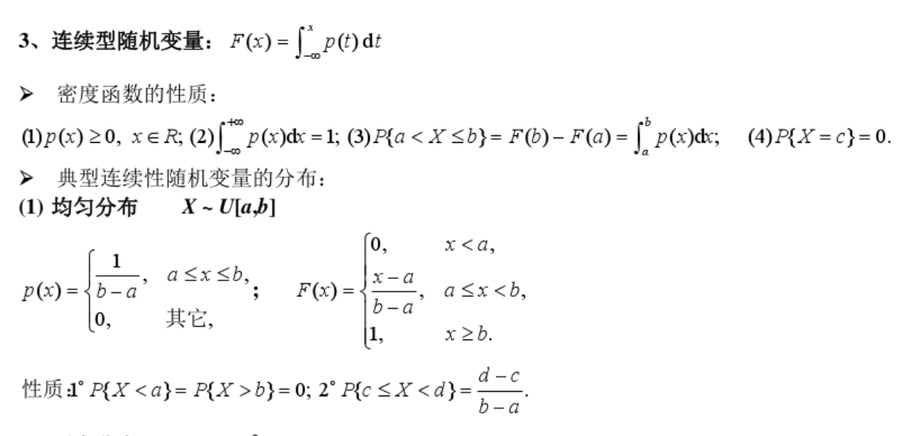
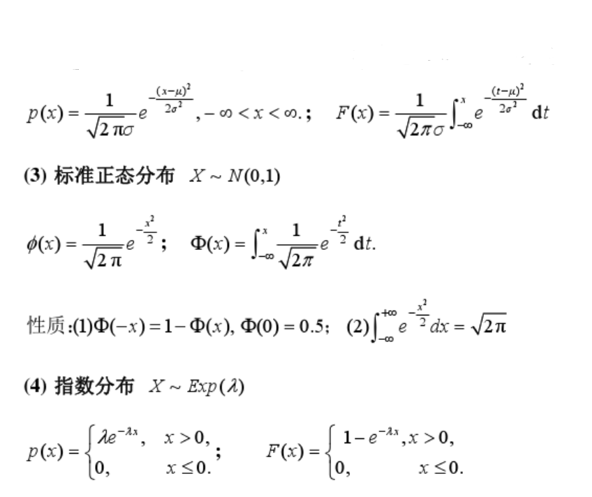
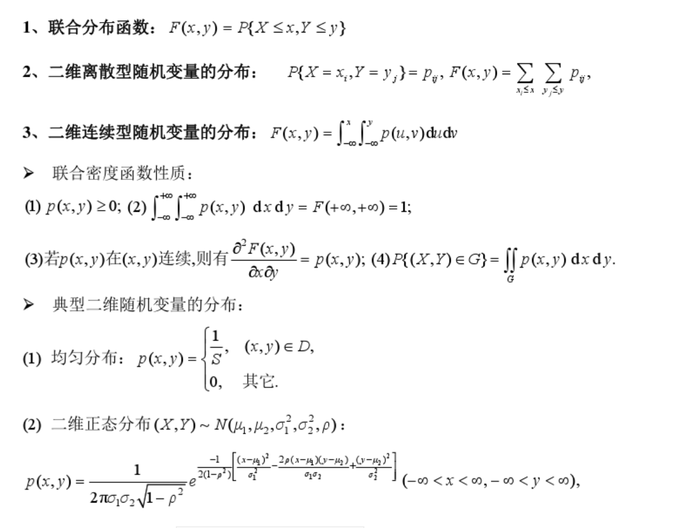

# 概率论与数理统计

----
2019-06-12  
最近太忙了,包括比赛啊 培训啊 很花时间,一直没时间更新,都两个月了吧.  
先更新这个吧 分为九章,当做自己的复习吧,  
估计很多人都用不到这些,但是说不定什么时候在企业干活累了  
就跑去教书了,有在实验室的工作经验和硕士+学历,  
混个初中老师应该没问题ε=(´ο｀)))  
就当做是备课吧.  

---------
2019-06-13  
昨天就测试过latex,发现github已经不支持了,又试了试latex在线版,  
我这网络巨卡,就算是传个github,都要几分钟...  
所以我决定使用windows自带的"数学输入面板",  
用图片的形式带上来吧.  

  

## 第一章 随机事件与概率

### 随机事件
在一次试验中可能出现也可能不出现的事件,统称为随机事件,记作A,B,C  

在理论上,我们称试验E所对应的的样本空间Ω的子集为E的一个随机事件,简称事件  

设A,B为两个事件,若A发生必然导致B发生,则称事件B包含事件A,也称事件A包含在事件B中;  

称事件"A B中至少有一个发生"为事件A与B的和事件,也称A与B的并,记作A∪B或A+B  

称事件"A,B同时发生"为事件A与事件B的积事件,也称A与B的交,记作A∩B,简记为AB  

称事件"A发生而B不发生"为事件A与B的差事件,记作A-B  

若事件A与事件B不能同时发生,即AB=Ø,则称事件A与事件B是互不相容的两个事件,简称A与B互不相容,或互斥事件.  

称事件"A不发生"为事件A的对立事件,记作"A非";  

若事件A与事件B中至少有一个发生,且A与B互不相容,即A∪B=Ω,AB=Ø,则称A与B互为对立事件;  

事件运算律:
设A B C为事件,则有:  
交换律:A∪B=B∪A, A∩B=B∩A;  
结合律:A∪(B∪C)=(A∪B)∪C, A∩(B∩C)=(A∩B)∩C;  
分配律:A∪(B∩C)=(A∪B)∩(A∪C),A∩(B∪C)=(A∩B)∪(A∩C);  
对偶律:
  

### 概率

设Ω是随机试验E的样本空间,对于E的每个事件A赋予一个实数,记为P(A).称为P(A)是事件A的概率.  

性质:  

(1) 0≤P(A)≤1  
(2) 加法公式: P(A∪B)=P(A)+P(B)-P(AB)  
(3) 减法公式: P(B-A)=P(B)-P(AB)  
(4) 古典概率:总数有限,可能性相同  

### 条件概率

已知事件B发生的条件下,事件A发生的概率,称为在事件B发生的条件下事件A的条件概率,记作P(A|B)  

  

乘法公式:  

  

全概率公式:  

  

贝叶斯公式:  

  

简单描述下:  
全概率公式用于已知多个条件,要求和总的条件概率.  
贝叶斯正好相反,已知结果的情况下,求某概率.  

### 事件独立性

两事件互相独立的定义:若P(AB)=P(A)P(B),则称A与B互相独立.  

三事件互相独立:  

  

事件互相独立的性质:
(1)设P(A)=0,

n重伯努利:

## 第二章 随机变量及概率分布

### 分布函数与性质

  

### 分布函数重要公式

  

### 离散型随机变量

  

### 连续型随机变量 均匀分布 正态分布 指数分布
  

<b>    (2) 正态分布</b>  

  

### 二维随机变量及其分布

  
