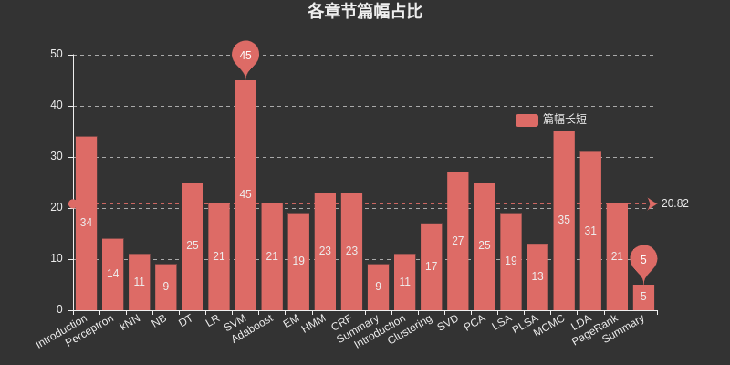

## 统计学习方法

这个的话,我建议参考李航老师的《统计学习方法》即可,直接看书也不错,我在考虑要不要贴上我的读书笔记,但是公式一个一个写会死人的.  

李航老师的发型证明了怹是位强大的人,我的发型进化过程也证明我也是个小强~  

我这先给出李航老师的目录

```
第一章 统计学习方法概论  
第二章 感知机  
第三章 k近邻法  
第四章 朴素贝叶斯法  
第五章 决策树  
第六章 逻辑斯蒂回归与最大熵模型  
第七章 支持向量机  
第八章 提升方法  
第九章 EM算法及其推广  
第十章 隐马尔可夫模型  
第十一章 条件随机场  
第十二章 统计学习方法总结  

```

### 关于对数底数
读书的时候经常会有关于对数底数是多少的问题，有些比较重要的，书中都有强调。 有些没有强调的，通过上下文可以理解。另外，因为有换底公式，所以，底具体是什么关系不是太大，差异在于一个常系数。但是选用不同的底会有物理意义和处理问题方面的考虑，关于这个问题的分析，可以看PRML 1.6中关于熵的讨论去体会。

另外关于公式中常系数的问题，如果用迭代求解的方式，有时对公式做一定的简化，可能会改善收敛速度。个中细节可以实践中慢慢体会。

### 关于篇幅

  

这里插入个图表，列举了各个章节所占篇幅，其中SVM是监督学习里面占用篇幅最大的，MCMC是无监督里面篇幅占用最大的，另外DT，HMM，CRF，SVD，PCA，LDA，PageRank也占了相对较大的篇幅。

章节之间彼此又有联系，比如NB和LR，DT和AdaBoost，Perceptron和SVM，HMM和CRF等等，如果有大章节遇到困难，可以回顾前面章节的内容，或查看具体章节的参考文献，一般都给出了对这个问题描述更详细的参考文献，可能会解释你卡住的地方。
