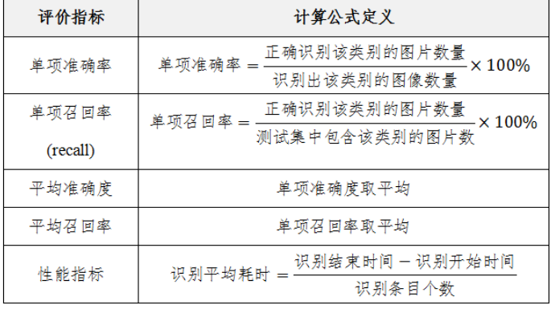

### 实验室研究现状说明及一些个人看法

#### 目前实验室常驻人员还是以在读硕士研究生为主,指导老师除我外基本上都是985 211中国著名高校博士  
---------------------------------
2019年4月26日  
这些天和实验室指导老师们--华科博士们谈论了在实际应用中的ai,  
我个人的话比较看重落地和实际应用,所参加的很多比赛也是也是冲着实践的目的去的,  
比如一个简单烟雾识别,不说其他的,论文没有一千篇也有一百篇以上和这个项目相关的,  
但实际情况是现行的任何算法,模型,均无办法彻底代替人类的工作,说不定还使人工费用和人工劳动增加了,  
这样使用ai技术这不是一种本末倒置么,  
还是说现在的ai技术仅仅能存在理论存在于实验室中,我发现就算是反欺诈,连微软也没敢说识别率怎么怎么样了,  
就中国的cv其实还是做得比较好的了,比如说人脸 身份这块的.  
简单的看论文数量就知道了.CVPR通过率在下降,19只有20-25左右,还是录了一千多篇,也就是说投稿还是有五六千篇,其中我也贡献了几个分母~~    

在更久之前我和一群交大的在读硕士研究生交流的时候,发现他们是只为了毕业论文而去的,向我提问的问题是非常功利的.  
比如说什么呢,他们会直接提问我,论文题目是什么什么,能不能给我写的代码算法模型什么的他们运行一下?  
其实提出这个问题,我就明白,不仅会运行我的代码,还会稍微修改一下我的代码,假装优化一下,就说是自己的成果,发论文,中心期刊....这都是很常规化的操作了,还以为我不懂...可是这样子的毕业有什么意义么,包括现在的一些中小企业,其实不仅仅是中心企业,很多企业都是如此,我这里不会为自己找麻烦点名出来,但是我也知道,加了ai的概念进去,不敢是什么技术,比如说不定是用了个xx学习训练什么结果,本质上和正则表达式在效果上并无差距,还是需要人工参与,不仅是要参与,还需要核查核对....  

其实在他们提出问题后,我也曾经小小的劝过他们,说不定我也不是正确的,但是我感觉他们这样得过且过的研究不着边际的东西,研究生嘛,本来就是得研究东西,但是研究一些说不定是弯路的东西我感觉是不是该告诉他们?  

实际应用和理论研究是有一定关系的,不做理论研究的话,那在实际应用中遇到一些问题是没办法根据科学研究方法解决问题的,我也并不信奉英雄主义和经验主义.   

----
----
2019年4月27日  
其实在竞赛当中就能发现,现在的比赛虽说也倾向于实际应用场景,但是冠军方法丢到真是环境中,也就这样吧...  
不能说这个方案不好,或者是算法模型什么不够优越,其实并不是这样. 且不说是什么项目~~
有次在一个实际项目落地的时候,有关部门一直反馈说什么什么识别不准确,我大致看了下,这个项目是直连摄像头的,摄像头转成图片图像来进行处理判断,这个冠军方案也是对图像的处理,我看过他的指标,没有问题的.  
  

有  
单项准确率  
单项召回率  
平均准确度  
平均召回率  
性能指标  

冠军方案还是相当优秀的,但是局限性就来了,你的训练数据集是给定的,测试数据集也是给定的,那凭什么在这样子的局限环境下要求这套东西能应付实际所有场景呢?  
在实际场景中,摄像头的数据并不可信,一存在很多干扰信息,比如雨 风 雾 等等,这是天气场景,在比赛中并无涉及;二是摄像头性能问题,转成图片后并不像数据集那么经过筛选,好像是人工数据标记;三这些摄像头居然是转动的!那为啥不提前和参加比赛的人说,提前加入比赛题目的要求里面,那参赛者加入这块进行考虑?四权限问题,上下沟通问题等行政问题,国企政企等你懂得,想一手处理摄像头?不可能.  

诸多原因造成了实际应用问题,并不是说只有研究理论的研究者超过了落地实践者而导致的理论和实际的脱节,原因可谓是非常的多,应该怎么逐一去解决这些问题呢,而且我说的也仅仅是一个落地实际的例子,也许并无通用性.  

其他怎么办?  

---

### link

[微信公众号--一些看法](https://mp.weixin.qq.com/s?__biz=MzIzMDYyNzMyNg==&mid=2247483809&idx=1&sn=163c295ef7b65b844cab153364f95d9d&chksm=e8b1c330dfc64a2607b0352e3c208d06633d31e02dcb86135c4ea8261812e5f0c0291d20041d&token=994086036&lang=zh_CN#rd)
